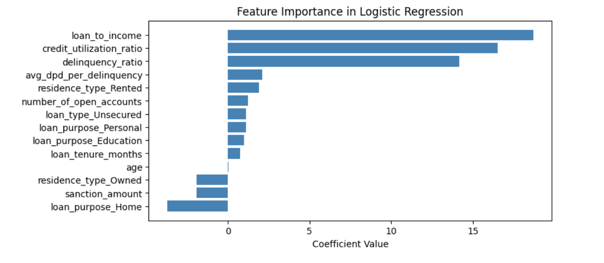

# TrustWave Finance: Credit Risk Modelling

### Description
In today’s financial landscape, assessing loan eligibility and managing risk are critical for both lenders and borrowers. The Credit Risk Modelling App simplifies this process by harnessing the power of machine learning and data-driven insights.The Credit Risk Modelling App provides instant predictions on the likelihood of loan defaults based on personal and financial details like age, income, loan amount, credit utilization, and more. 

### Features
- **Credit Score Prediction:** Generates a credit score ranging from 300 to 900.
- **Default Probability Estimation:** Estimates the probability of default based on applicant data.
- **Risk Categorization:** Classifies the credit risk into four categories: Poor, Average, Good, and Excellent.
- **Interactive User Interface:** A user-friendly interface built using Streamlit where users can input applicant data and get instant results.

### Technology Stack
* Pandas: For data handling and manipulation.
* Scikit-learn: Used for machine learning model training, scaling, and preprocessing.
* Joblib: For saving and loading the trained models and scalers.
* Python: Core language for the backend processing.
* Streamlit: For building the web application and user interface.

### Model
The model used for this project is a logistic regression model, trained using a dataset of loan applicants with various features. The model predicts the likelihood of loan default and generates a credit score based on the probability of default.
#### Feature Importance
The following image shows the importance of each feature used in the model:

